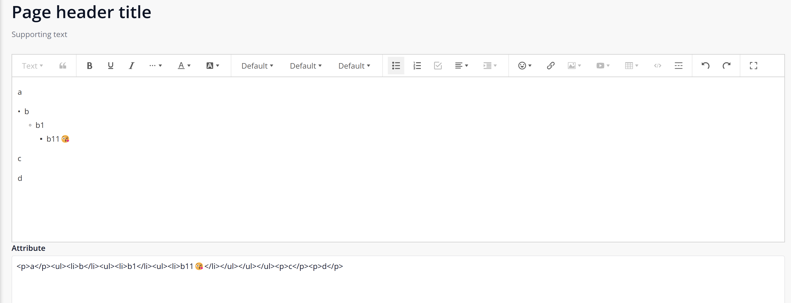

## RichText2
Lightweight Web Rich Text Editor, easy to configure and easy to use. wangEditor 5 based implementation.

## Features
Supports multiple languages. Currently, only en and cn are supported

Convenient configuration, simple to use.

Indent for ordered and unordered lists is supported

Support mobile terminal

## Keyboard shortcuts
Ctrl + B: Bold
Ctrl + I: Italic
Ctrl + U: Underline
Ctrl + Z: Undo
Ctrl + Y: Redo
Ctrl + C: Copy
Ctrl + V: Paste

## Dependencies
Mendix 9.x

## Installation Configuration
Place the widget in a data view, list view or template grid with a data source that has a string attribute and select the 'Value attribute' that contains the editable text.

## Screenshots

